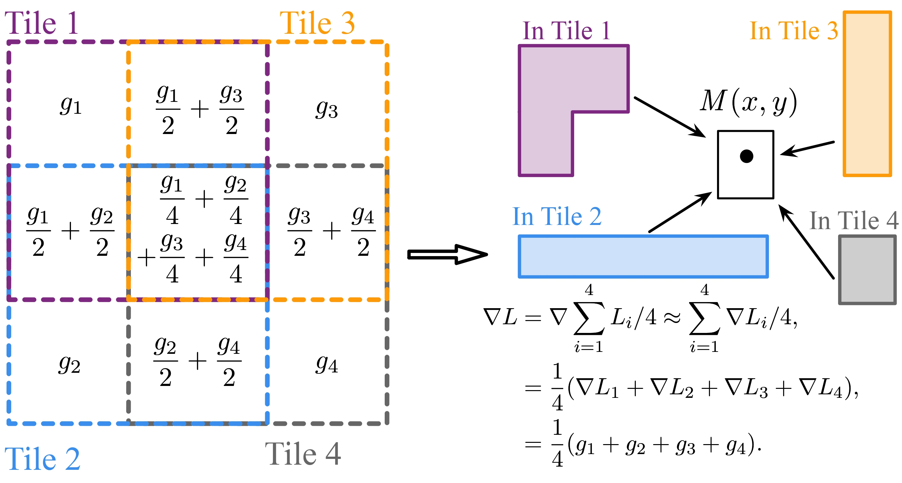
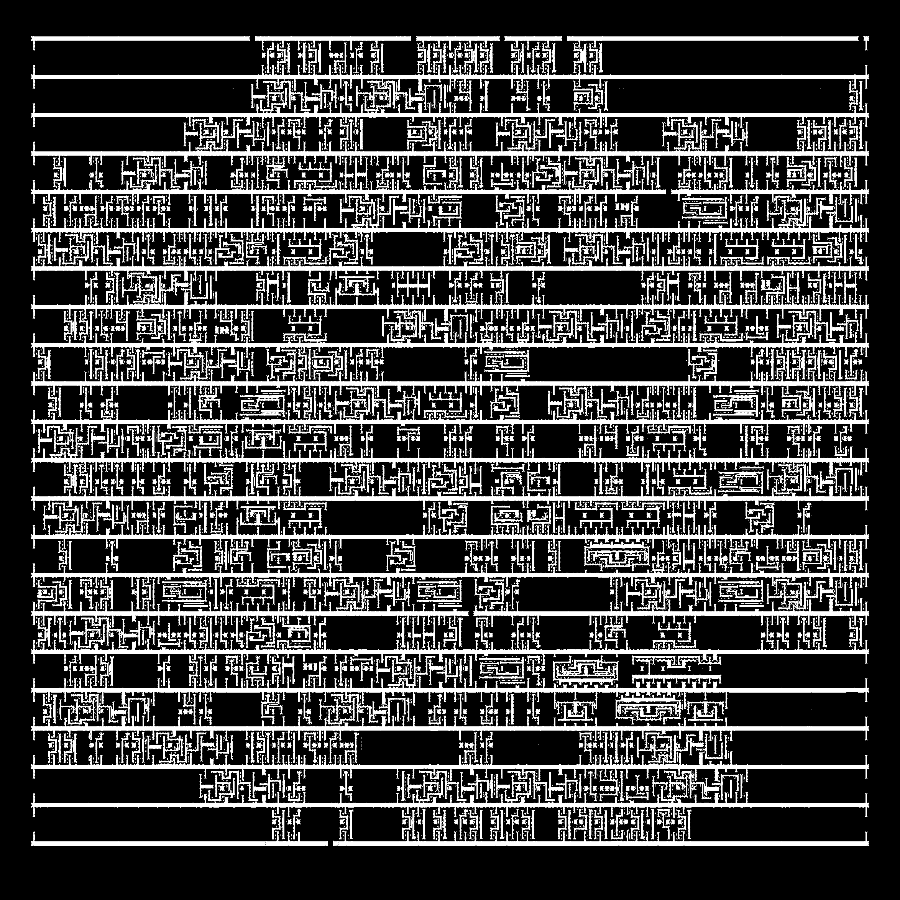

<p align="center">
  
</p>

# OpenFuILT

This repository contains the official implementation of the **ISPD 2024** paper: *FuILT: Full Chip ILT System With Boundary Healing*.

Install the OpenFuILT as a package using

```shell
python setup.py install
```

## Dependency

To use this project, ensure the following dependencies are installed:

1. **Environment**: Python **3.11**
2. **PyTorch**: With CUDA support for GPU acceleration
3. **TorchLitho**: Install from the official repository: [TorchLitho-Lite](https://github.com/OpenOPC/TorchLitho-Lite)

## Overview

**FuILT** is a distributed training platform designed for **Inverse Lithography Technology (ILT)**-based mask optimization. It introduces a novel **gradient fusion strategy for boundary healing**, which establishes itself as the current state-of-the-art (SOTA) algorithm for full-chip scale ILT.

## Key Features

- **Gradient Fusion for Boundary Healing**: The first proposed strategy in this domain, enabling seamless optimization at the boundaries of chip layouts.

- **Distributed Training Platform**: Designed for scalability and efficiency, making it suitable for full-chip scale applications.

The gradient fusion strategy utilizes a **linear averaging approach** to handle the influence of different tiles in the overlapping regions, as illustrated in the following figure.

<p align="center">
  
</p>

Our distributed strategy consists of a **two-level partitioning scheme**:

1. **Macro Level**: The full-chip layout is divided into **patches**, which can be efficiently processed by the GPU.
2. **Micro Level**: Each patch is further subdivided into **tiles**, enabling the application of the ILT algorithm to compute gradients.

The framework is implemented using the **Thread library** and follows a **master-worker strategy** to achieve efficient parallelization.

<p align="center">
  
</p>

## Run

Before running OpenFuILT, you may install TorchLitho-Lite from "https://github.com/OpenOPC/TorchLitho-Lite".

Other dependencies can install by

```shell
pip install -r requirements.txt
```

If you encountered errors about *pyarmor*, you can try to switch your Python version to **3.11.7**. You may use Anaconda to create a dedicated environment. The error looks like: 
```
ImportError: /.../OpenFuILT/openFuILT/pyarmor_runtime_000000/pyarmor_runtime.so: undefined symbol: _PyCode_Validate
```

The FuILT platform provides user-friendly APIs that allow users to implement ILT algorithms seamlessly within the FuILT environment.

In **OpenFuILT**, we introduce a new frontend for ILT algorithm development. The ILT algorithm is modularized into three main components:

1. **Initializer**: Transforms the mask into an optimizable parameter, preparing it for optimization.
2. **Binarizer**: Converts the optimized parameters into a binary mask after the optimization process.
3. **Algorithm**: Given the mask and target, calculates the loss, serving as the core of the ILT workflow.

The following code demonstrates an example of **SimpleILT**, implemented using the **FuILT APIs**.

```python

from openFuILT import FuILT
from openFuILT.semantic import SGD
from openFuILT import opc
from pylitho import Abbe
import torch
import torch.nn.functional as func

sigmoidStepness = 4.0
stepness = 50.0
targetIntensity = 0.225

def initializer(mask : torch.Tensor) -> torch.Tensor:
    return  mask * 2.0 - 1.0

def binarizer(mask : torch.Tensor) -> torch.Tensor:
    return torch.sigmoid(sigmoidStepness * mask)

@opc(initializer=initializer, binarizer=binarizer)
def simpleILT(mask : torch.Tensor, target : torch.Tensor) -> torch.Tensor:
    canvas = target.shape[0]
    simulator = Abbe(
        canvas=canvas,
        pixel=14,
        defocus=[0, 30, 60],
        )
    mask = binarizer(mask)
    image = simulator(mask) # NCHW
    image = torch.sigmoid(stepness * (image - targetIntensity))
    return func.mse_loss(image[0][0], target, reduction='sum') + func.mse_loss(image[0][1], image[0][2], reduction='sum')


if __name__ == "__main__":
    # initial FuILT engine
    engine = FuILT(num_worker=2, device_ids=[0, 2]).set_verbose()

    # set layout and pixel size
    engine.set_layout("benchmarks/gcd.gds", layer=11).set_pixel(14)

    # set macro and micro parameters
    engine.set_macro_params(macro_size=[2, 2], 
                            macro_olrate=0.1).set_micro_params(level=2, 
                                                               micro_olrate=0.1)

    # set optimizer, learning rate, and epochs
    engine.set_optimizer(SGD()).set_lr(0.5).set_epoch(10)

    # run FuILT
    engine.solve(simpleILT)
    
```

You may change the "num\_workers", "device\_ids" in FuILT(...) to fit your devices. 

The result of the optimized mask simulation is shown below:

<p align="center">
  
</p>

## Evaluation

We provide several APIs in the FuILT engine that allow users to save the optimized mask and target layer as GDSII files.

You can use the API to generate a pickle file of the mask and a GDSII file of the target, which can be used as inputs for our evaluation framework, OpenFuILT-Eval.

```python
def getFullMask(self) -> np.ndarray:
        '''
        get full chip mask
        Returns:
            np.ndarray: full chip mask
        '''
        ...
        
@staticmethod
    def writePickle(mask : np.ndarray, file_path : str):
        '''
        write mask to pickle file
        Args:
            mask (np.ndarray): mask to be written
            file_path (str): path to the pickle file
        '''
        ...
```

```python
def writeTargetGDS(self, file_path : str):
        '''
        write target gds file
        Args:
            file_path (str): path to save gds file
        '''
        ...
```

For the evaluation, please refer to the repository [OpenFuILT-Eval](https://github.com/OpenOPC/OpenFuILT-Eval).

## Citation

If you find this project helpful in your research, please consider citing our paper:

```ini
@inproceedings{yin2024fuilt,
  title={FuILT: Full chip ILT system with boundary healing},
  author={Yin, Shuo and Zhao, Wenqian and Xie, Li and Chen, Hong and Ma, Yuzhe and Ho, Tsung-Yi and Yu, Bei},
  booktitle={Proceedings of the 2024 International Symposium on Physical Design},
  pages={13--20},
  year={2024}
}
```

